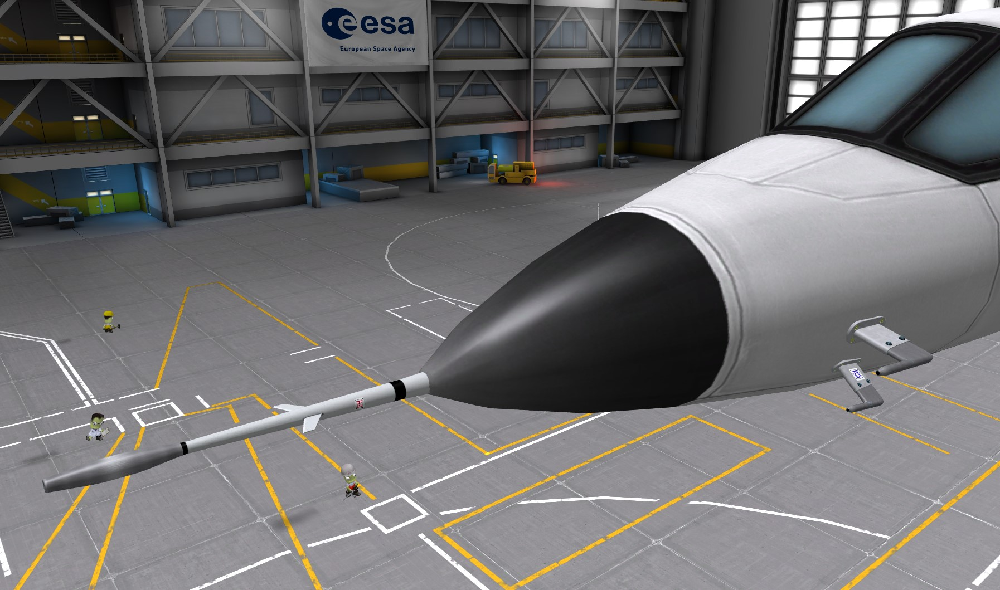
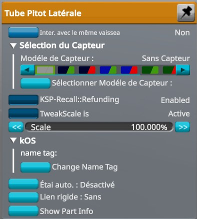

# __ PlaneTool __

Add some details to plane in KSP  
# [WIKI](https://github.com/Massetstephane/PlaneTool/wiki) and futur Part.

`in KSP when dezooming appear a light green blue wireframe on both parts! also visible in left part panel `
______
Pitot tube updated to 1.12.3 (Partools 1.12) with emissive anim heat texture (pitot nose for moment).

| Pitot Nose | Pitot Side |
| ------------------------------------------- | ----------------------------------------------- |
|____  |____     |
| You can choose the sensor type or no Sensor | Same function but two part Left & Right |
| Sensor ex : TEMP  |
______
> How to change sensor in editor
  - Place the part, Right click on the part installed and you have choice Between (no sensor and the four sensor L&R)
  
    
    
    After a week of test i can't make one part for the pitot lateral, if i use two B9PartSwitch module i loose the sensor
    tested a combination with modulePartVariants (KSP) problem is on the flag texture, using ksp module for the Left or right
    side, and the flag texture reset to material startup in unity, it's work but i don't like. 
______

> MODS required
- Module Manager 4.2.1 [sarbian](https://forum.kerbalspaceprogram.com/index.php?/topic/50533-18x-112x-module-manager-421-august-1st-2021-locked-inside-edition/#comment-720814)
- B9PartSwitch_v2.19.0 [blowfish](https://forum.kerbalspaceprogram.com/index.php?/topic/140541-1112-b9partswitch-v2180-march-17/)

> Optional 
- If TweakScale installed a MM Patch add module in Part *(I recommend hard to fit for all cockpits)*
______
## INSTALLATION
- Copy the folder **PlaneTool** into your KSP GameData directory. 
______

## LICENCE
GNU GENERAL PUBLIC LICENSE Version 3, 29 June 2007
