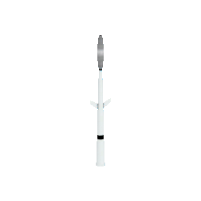
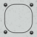
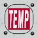

# PlaneTool
Add some details to plane in KSP

Pitot tube updated to 1.12.3 (Partools 1.12) with emissive anim heat texture.

| Pitot Nose|
| ----------------------------------|
|  |
| You can choose the sensor type or no Sensor|
| Ex:No Sensor  TEMP  |
______

> MODS required
- Module Manager 4.2.1 [sarbian](https://forum.kerbalspaceprogram.com/index.php?/topic/50533-18x-112x-module-manager-421-august-1st-2021-locked-inside-edition/#comment-720814)
- B9PartSwitch_v2.19.0 [blowfish](https://forum.kerbalspaceprogram.com/index.php?/topic/140541-1112-b9partswitch-v2180-march-17/)

> Optional 
- If TweakScale installed a MM Patch add module in Part
______
## INSTALLATION
- Copy the folder **PlaneTool** into your KSP GameData directory (file : PlaneTool-1.0.0.zip)
______

## LICENCE
GNU GENERAL PUBLIC LICENSE Version 3, 29 June 2007
