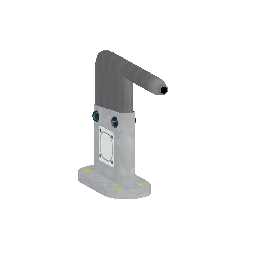

# __ PlaneTool __

Add some details to plane in KSP

`in KSP when dezooming appear a light green blue wireframe on both parts! also visible in left part panel `
______
Pitot tube updated to 1.12.3 (Partools 1.12) with emissive anim heat texture (pitot nose for moment).

| Pitot Nose | Pitot Side |
| ------------------------------------------- | ----------------------------------------------- |
|____  |____________     |
| You can choose the sensor type or no Sensor | Same function with two option for indicator Left & Right |
| Ex:No Sensor  TEMP  |
______
> How to change sensor in editor
  - Place the part, Right click on the part installed and you have two section in panel
    
    
    Top section change the sensor (sensors variants) | bottom choose Left or Right indicator
______

> MODS required
- Module Manager 4.2.1 [sarbian](https://forum.kerbalspaceprogram.com/index.php?/topic/50533-18x-112x-module-manager-421-august-1st-2021-locked-inside-edition/#comment-720814)
- B9PartSwitch_v2.19.0 [blowfish](https://forum.kerbalspaceprogram.com/index.php?/topic/140541-1112-b9partswitch-v2180-march-17/)

> Optional 
- If TweakScale installed a MM Patch add module in Part *(I recommend hard to fit for all cockpits)*
______
## INSTALLATION
- Copy the folder **PlaneTool** into your KSP GameData directory. 
______

## LICENCE
GNU GENERAL PUBLIC LICENSE Version 3, 29 June 2007
